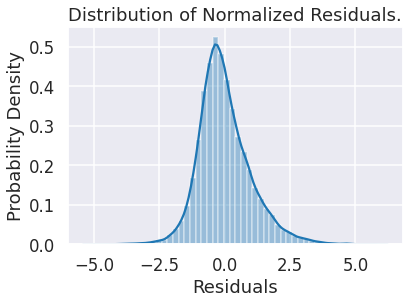

# Housing Market Analysis

In this repository we analyze housing data from King County in Seattle. We produce a regression model for house price and investigate the factors that influence price.

## Business Problem 

For this project we identify our hypothetical stakeholder as King County Assessor [John Wilson](https://www.kingcounty.gov/depts/assessor/About-Us/Assessors-Bio.aspx). We are asked to use data from house sales in King County occurring between May 2, 2014 and May 27, 2015 to produce a model for house prices. This model will be used by the assessor to validate the existing property taxation model.

## Key Insights
In this section we briefly summarise our findings as they relate to the business problem.
### Model
[View Notebook](/notebooks/PricingModel.ipynb)

We produced a linear model for the base 10 logarithm of price. That is, if the price of a house is , then the target for our linear model is . Our model incorporates four input variables, which we will denote as  for  Each variable is described below.
 1. The variable  is an indicator variable that is 1 if the house is in one of zip codes that we have identified as having low median price and 0 otherwise.
 2. The variable  is an indicator variable that is 1 if the house is in one of zip codes that we have identified as having intermediate median price and 0 otherwise. Note that when both indicator variables are zero, the house is in one of the zip codes that we have identified as having high median price.
 3. The variable  is a continuous variable that describes the total livable square footage of the houses 15 nearest neighbors. This variable has been Box-Cox transformed with parameter .
 4. The variable  is a continuous variable that describes the number of bathrooms per bedroom in the house. This variable has been Box-Cox transformed with parameter .

Our linear model takes the form:

The model describes 64% of the variation in log price.

### Spatial Distribution of Price
[View Notebook](notebooks/PriceSpacialDistribution.ipynb)

We investigated the relationship between price and location by mapping prices by latitude and longitude. We see that higher prices are centered around lake Washington, particularly around the center of lake Washington between the Madison Park and Clyde Hill neighborhoods. We identify latitude = 47.62 and longitude = -122.25 as the approximate center of this region of higher prices. 

### Classification of Zip Codes by Price
[View Notebook](notebooks/PriceZipcodeDistribution.ipynb)

We investigated the median price by zip code in King County. We found that 98039 had the highest median price at $1,894,941 and that 98168 had the lowest median price at $235,000. For the purposes of modeling, we chose to classify zip codes as low price if their median price was in the bottom third of the distribution of median prices by zip code. Similarly, zip codes in the middle third were categorized as medium price and zip codes in the top third were categorized as high price. 

### Bathroom to Bedroom Ratio
[View Notebook](notebooks/BathBedRatio.ipynb)

In the process of modeling we found that, unsurprisingly, the number of bathrooms that a house has is highly correlated with the number of bedrooms as well as the size of the house. In order to extract some useable information from the provided data, we computed the number of bathrooms per bedroom. We found that a model using number of bedrooms and number of bathrooms as predictors of log price described 28% of the variation in log price, but suffered from high variance inflation factors. Replacing number of bedrooms with the number of bathrooms per bedroom produced a model that described %26 of the variation in log price, while reducing variance inflation factors by about half and brining them within an acceptable range.

## Data Validation and Cleaning
[View Validation Notebook](notebooks/DataValidation.ipynb)
[View Cleaning Notebook](notebooks/DataCleaning.ipynb)

During data validation we identified the following issues in the raw data. 
 * We found missing values in the `veiw` variable, which described the quality of the views available from the house. We chose to fill missing values with zeroes under the assumption that view had no appreciable influence in the price of these houses. 
 * We found missing values in the `waterfront` variable, which was an indicator variable for proximity to the waterfront. We filled missing values with zeroes (False) under the assumption that the variable was more likely to be reported correctly for waterfront homes and that the vast majority of houses are not on the waterfront.
 * We found that the `yr_renovated` variable contained both missing values and zeros indication that the house had not been renovated. We chose to fill both missing values and zeroes with False. 
 * The `date` variable was a formatted string. To facilitate data processing, we converted this variable to a datetime object.
 * We found that the `sqft_basement` variable used `?` as a placeholder for missing values. We converted `?`s to zeroes under the assumption that houses with missing information about the basement did not have sufficiently finished basements to substantively influence the price of the house.

## Model Validation 
Our model is essentially sound. It suffers from non-normality of residuals and does not describe as much of the variation in price as we would like.
### Linearity
By choosing to model the log price of houses, we achieve linear relationships between our input variables and the target. More precisely, the bottom row of the pair plot below shows that there are no strong non-linear relationships between the input variables and the target. The pair plot also shows that there are no concerning non-linear relationships between input variables, which could be missed by assessing correlation or variance inflation factors.

### Normality of Residuals
We check for normality of residuals by inspecting both a distribution plot and a QQ plot of the residuals. We also executed a Kolmogorov–Smirnov test for normality. All three, tests reject the hypothesis that the residuals are normally distributed.

#### Residual distribution plot

#### Residual QQ plot

### Uniform Variance of Residuals
By inspecting the plot of residuals against the predicted target below we conclude that the variance of the residuals is independent of the predicted value. In other words, our model satisfies the homoscedasticity hypothesis. 

#### Residuals vs Predicted Values

### Residuals Are Independent of Inputs
By inspecting the plots below we determine that the residuals are independent of the input variables.

#### Residuals vs Input Variables

### Linear Independence of Inputs
For all four of our input variables we computed variance inflation factors below 5. This indicates that our model does not suffer from linear dependence in the input variables.

### Significance of Parameters
As note above our residuals are not normally distributed. However, we note that the t-scores for each of our coefficients exceeds 5 in absolute value. If we were to correct the distributions used in the hypothesis tests for our coefficients, there would not be a sufficient change in the p-values produced to threaten significance. Therefore, we claim that all of our coefficients are non-zero at the 95% confidence level. 

### Measures of Model Quality
For our log price model we compute a training R^2 value of 64% and a testing R^2 value of 62%. While these values are lower than we would like, they are consistent between the training and testing data, which indicates that our model generalizes well. 

We computed root mean squared error for our model when it is transformed from log price to price. We found that training RMSE was $268,742 and testing RMSE was $265,454. The size of this error means that our model is not sufficiently precise for our application. However, the degree of consistency between testing and training data further confirms the generalizability of our model. 

## Points of Interest
Below I would like to highlight are a few aspects of this project that are not directly relevant to the business problem.

### Test Driven Design
In this project I tried to implement test driven design, creating unit tests for each function. This practice helps to ensure that code is doing what we intend and makes refactoring code safer, since we can easily verify that refactored code is still doing what it is intended to do.

### Object Oriented Programming
In python, creating and evaluating a linear regression model requires accessing methods from several libraries with differing approaches to managing the data and outputs. To facilitate a more streamlined workflow, we wrote a class that encapsulates the necessary linear regression functionality 
